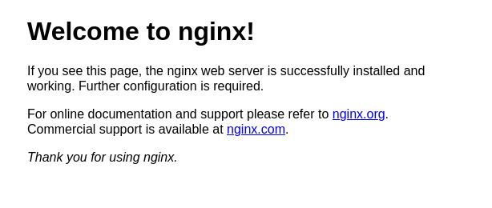

# Упражнение 1. 
## Создать Terraform скрипт. 

### Цель.
1. Реализовать терраформ для разворачивания одной виртуалки в yandex-cloud
2. Запровиженить nginx с помощью ansible. 

## Выполнение. 

## 1. Создание скрипта терраформ. 

Для выполнения задания использовался сервис Yandex Cloud.  На рабочей машине с ОС Fedora 39 был устанволен terraform в соответствии с инструкцией на сайте яндекса. После выполнения всех пнуктов по установке и настройке, проверяем версию установленного приложения. 

```bash
$ terraform -v
Terraform v1.8.2
on linux_amd64
```
Отображении версии 1.8.2, говорит нам о том, что terraform работает и версия его 1.8.2 

Следующим шагом добавил в систему переменные окружения  

```bash
export YC_TOKEN=$(yc iam create-token)
export YC_CLOUD_ID=$(yc config get cloud-id)
export YC_FOLDER_ID=$(yc config get folder-id)
```

Так как, переменные после каждого перезапуска оболочки не сохраняются, то я добавил их в .bashrc. Что облегчит работу в будущем. И сократит время на присвоение этих переменных, каждый раз, когда будет перезапускаться оболочка. 

Далее настраиваем провайдера в соответствии с инструкцией на сайте. Для этого в домашнем каталоге редактируем файл конфигурации Terraform: *.terraformrc*. 

После непосредственной настройки приложения и аккаунта в Yandex Cloud, приступаем к созданию своего первого проекта в этом обучении. Первым делом в рабочем каталоге создаем конфигурационный файл **main.tf**, в котором начнем описывать наш будущий инстанс. 

Добавляем в наш конфигурационный файл первые блоки: 
+ required_providers, здесь мы описываем в директиве source, глобальный адрес источника провайдера. 
+ required_version - минимальная версия Terraform, с которой совместим провайдер
+ provider - название провайдера, в котором указываем zone - зона, в которой по умолчанию будут создаваться облачные ресурсы. 

На этом этапе, инициализируем провайдеров, указанных в конфигурационных файлах, чтобы можно было начать работать с ресурсами и источниками данных. 

```bash
$ terrafom init
```

Судя по результатам на экране, все прошло отлично 


Теперь приступаем к описанию инстанса. 

Инстанс будет с 2 ядрами ЦПУ и 2Гб памяти ОЗУ. Диска для наших целей будет достаточно 10Гб. В качестве ОС выбран debian. 

Имэдж для установки системы взят из доступных для установки на yandex cloud. Можно собрать и самому, но это долго и не в этом случае. Достаточно и того, что имеется. 

Для просмотра имеющихся образов, можно воспользоваться следующей командой 

```bash
$ yc compute image list --folder-id standard-images
```


Первым блоком описываем диск (yandex_compute_disk), указывая имя (name), тип диска (type), зону расположения (zone), размер (size), и id образа, из которого будет устанавливаться система (image_id).


Далее описываем сам инстанс. 

+ **resources** - ресурсы задействованные в инстансе
+ **boot_disk** - загрузочный диск, описанный в предыдущем пункте
+ **network_interface** - подсеть, к которой будет подключен инстанс
+ **metadata** - данные, которые передаются в инстанс. В моем случае это SSH ключ, с которым в последствии буду подключаться к ВМ. Можно создать отдельного пользователя, но у меня как-то не получилось, буду разбираться. Позже исправлю. 
+ **provisioner** - действия, которые необходимо выполнить после создания инстанса. 

Затем создаем сеть и подсеть в блоках yandex_vpc_network и yandex_vpc_subnet. Так как в новом аккаунте ничего у меня этого не было, создаем сейчас, если уже созданы, можно использовать имеющиеся. 


Файл **outputs.tf** - переменные для вывода внутреннего и внешнего ip. Используются для удобства получения данных, чтобы не искать их в web интерфейсе. 

После того, как все описано, проверяем синтаксис 

```bash
$ terraform validate
Success! The configuration is valid.
```

Смотрим, что у нас создастся после выполнения скрипта

```bash
$ terraform plan
```


Здесь можно увидеть, то что у нас создастся. Если все ок. Запускаем следующую команду

```bash
$ terraform aply
```

Результат выполнения 


Проверяем в web-интерфейсе, видим 1 ВМ, 1 диск, 1 сеть и 1 подсеть. Все создалось удачно. 


## 2. Установка nginx с помощь ansible. 

Установка nginx производится с помощью ansible, плэйбук для установки *provision.yml*. Вызов плэя осуществлен в блоке *provisioner*, как локально запускаемая команда ***local-exec***. Так как, ***local-exec*** может выполниться, не дожидаясь запуска сервера, было использован первоначальный запуск в ***remote-exec***, которая запускается гарантировано после запуска сервера. В данном случае выполнено обновление списка реп (что никогда не будет лишним). 

С помощью playbook устанавливается nginx, запускается и добавляется в автозагрузку соответствующая служба. По итогу на внешнем ip адресе, получаем работающий сервер. 




