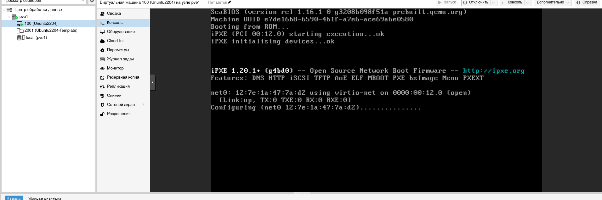

# Виртуализация Proxmox

## Цель

+ Terraform скрипты для развертывания виртуальных машин в проксмоксе

## Описание/выполнение

PROXMOX разворачивается на виртуальной машине Vagrant, с помощью Ansible.

В Proxmox создается шаблон ОС Ubuntu.

В терраформ настраивается провайдер "telmate/proxmox".

Далее создаем скрипт Terraform с помощью которого создается ВМ из шаблона Ubuntu. В итоге получаем готовыю ВМ на Proxmox.

