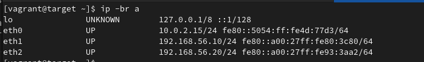
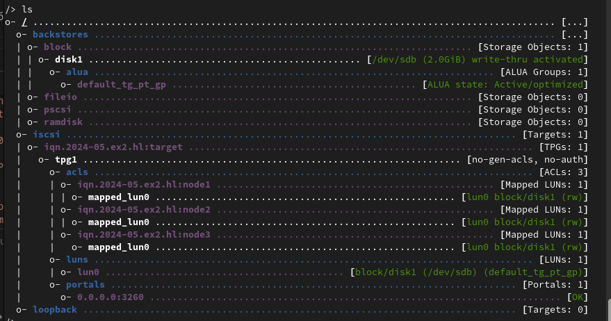
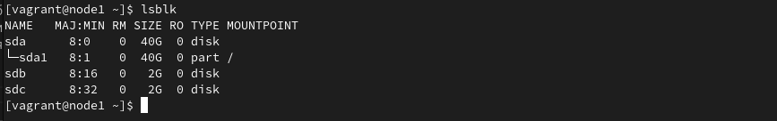
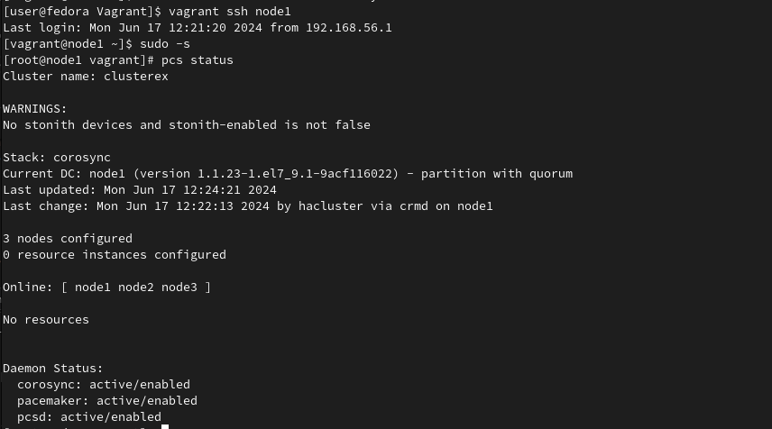
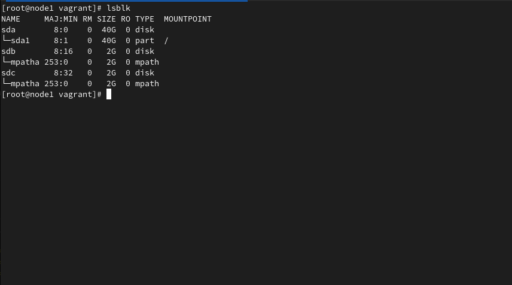
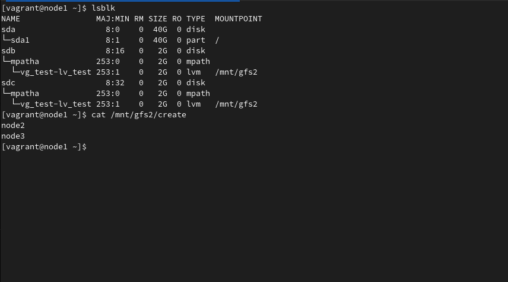

# Упражнение 2

## ISCSI, multipath и кластерные файловые системы: GFS2

### Цель

1. Разобрать принципы ISCSI
2. Разобраться, что такое multipath
3. Настроить общее хранилище для трех НОД

## Выполнение

## 1. Создание стенда Vagrant

Для выполнения задания использовался сервис Vagrant.

Из Vagrantfile создается 4 ВМ одна - target и три node[1-3].

На ВМ Target сождается ISCSI, а так же два сетевых интерфейса eth1 b eth2 для имитации избыточности отказоустойчивости.

Настройка хостов производится с помощью Ansible. Для настройки ISCSI используется готовая роль OndrejHome.targetcli-modules.

## ISCSI

ISCSI настраивается с помощью роли "iscsi". В процессе работы, настравиается target и ноды. Для target:

1. Утсанавливается утилита trgetcli, запускается сервис и добавляется в автозагрузку.
2. Создается backstore
3. Создается iqn
4. Назначается LUN
5. Добавляются ноды в ACL

По окончанию отработки плэя на target получаем следующую картину

Для ISCSI:

1. Утсанавливается утилита iscsi-initiator-utils.
2. Устанавливается iqn в файле /etc/iscsi/initiatorname.iscsi
3. Дискаверятся оба адреса с таргета
4. Происходит логин на таргете.
5. Перезагружается сервис iscsi для того, чтобы все настройки применились

В итоге получаем два диска на нодах.

Хоть на ноде они обозначаются, как два разных блочных устройства, по факту это один и тот же диск, к которому нода получает доступ по двум разным сетевым путям.

## PACEMAKER

Далеe выполняется на нодах плэй *pacemaker*. В нем:

1. Создается файл */etc/hosts*
2. Отключается SElinux
3. Устанавливаются необходимые пакеты
4. Запускается и добавляется сервис **pcsd**.
5. Устанавливается пароль для пользователя *hacluster*.
6. Далее авторизуем и устанавливаем кластер.

По итогу получаем работающий кластер из трех нод

## Multipath

Далее объединяем оба блочных устройства, полученных с iscsi в одно с помощью multipath. Для настройки используется роль *multipath*. В нем:

1. Устанавливается необходимая утилита.
2. Добавляется модуль dm_round_robin для обеспечения отказоустойчивости маршрутов.
3. Устанавливается конфиг
4. Запускается сервис multipath
5. Добавляются в multipath блочные утсройства с iscsi.

## GFS2

В этой роли поверх multupath создается LVM, соается ФС gfs2, монтируется /mnt/gfs2 и в нее кладется файл, в который каждая нода пишет свой хостнэйм. Фенсинг не использовался, так как для Vagrant в задании он не требуется для YC не нашел, что можно применить.

В этой роли производятся следующие работы:

1. Устанавливаются необходимые пакеты.
2. Устанавливается параметр locking_type=3. Без него кластерная ФС не будет работать.
3. Отключается stonith, так как он нам не понадобится.
4. Параметр no-quorum-policy устанавливается в freeze, так как его полное отключение помешает создать gfs2.
5. Создаются ресурсы dlm и clvmd.
6. Утсанавливается constraint. Сначала dlm потом clvmd
7. Создается PV, VG, LV.
8. Производится разметка логического волюма в gfs2
9. Создается кластерный ресурс, который автоматически монтирует каталог к LV.
10. Создается файл для проверки работы.Из-за конкуренции в доступе к файлу, вполне возможен вариант, что не каждая нода сможет записать туда свой хостнэйм, так как TASK в плэй запускается одновременно.  

## 2. Terraform

Плэйбук, используемый в случае ВМ в облаке аналогичный. Отличие только в получении переменных. Галвный плэй, который запускает роли формируется из темплэйта, в котором устанавливаются переменные для правильной работы.

С помощью скрипта терраформ, аналогично разворачиваются 4 ВМ, таргет и три ноды. Таргет с двумя сетевыми устройствами.

P.s.  В данный момент создать инстанс с двумя сетевыми интерфесами создать не предоставляется возможным. Это ограничение от yandex cloud. Так что проверить правильность работы пока не предоставляется возможным. С одним интерфейсом все работает, но создать multipath не получится. Как поддержка Яндекс снимет ограничение, дополню описание и проверю на ошибки.
