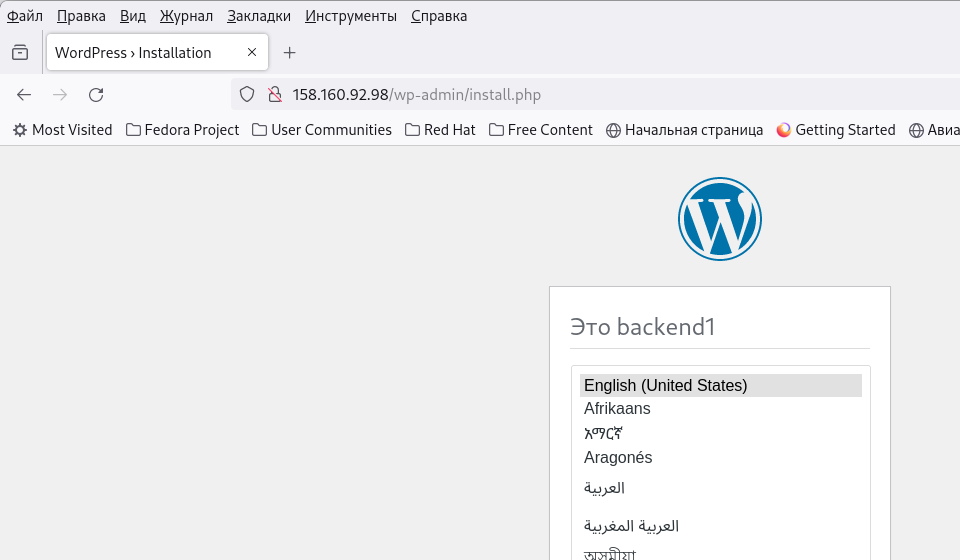
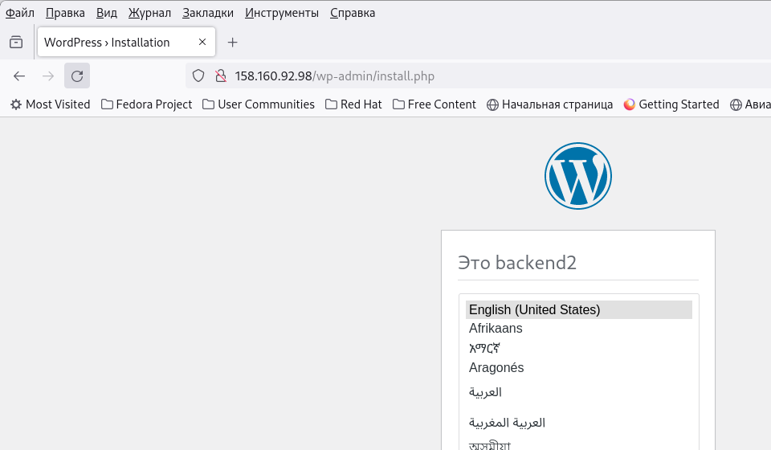

# NGINX - балансировка и отказоусточивость

## Цель

+ Научиться использовать NGINX в качестве балансировщика.

## Описание

В результате выполнения задания, разворачивается 4 ВМ:

+ Балансировщик на базе NGINX.
+ 2 виртуальных машины с установленным wordpress.
+ Сервер БД для работы wordpress.

Вся инфраструктура разворачивается в облаке, окончательная настройка и установка приложений производится с помощью ansible.

## Сервер БД

В качестве БД используется MySQL. На сервере создается БД для wordpress, а так же пользователь, с помощью которого наше веб-приложение будет коннектиться к базе.Все операции проводятся с помошью роли 'database'.

## Бэкенд

Для веб приложения выбран wordpress. На двух серверах утстанавливается php-fpm (роль php), nginx (роль nginx) и wordpress (роль wordpress). Для того, чтобы потом отличить первый бэкенд от второго, на стартовой странице установки wordpress добавлены заголовки для обозначения.

## Балансер

На сервер утсанавливается nginx и настраивается в качестве балансировщика трафика между бэкендами. В качестве демонстрации выбран самый пройстой сценари Round Robin. При таком подходе, запросы направляются по очереди по кругу к каждому бэкенду.

## Результат

В итоге, после отработки всех скритов получаем следующее. При заходе по публичному адресу на балансир, сначала попадаем на один сервер

Обновляем страничку и попадаем на другой сервер

Балансировка работает.
