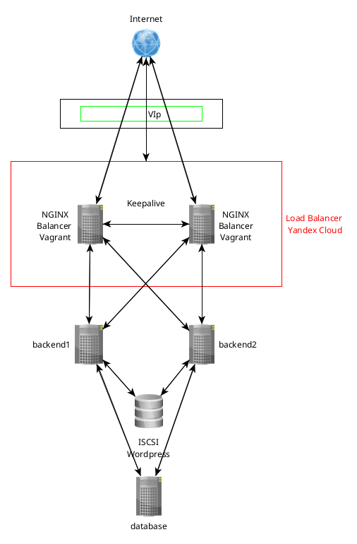
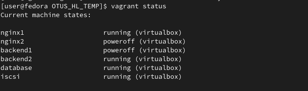

# NGINX - балансировка и отказоусточивость

## Цель

+ Настройка конфигурации веб приложения под высокую нагрузку

## Описание

В результате выполнения задания, разворачивается 6(4) ВМ:

+ 2 ВМ для балансировщика на базе NGINX, с контролем состояния keepalive. В случае с Yandex Cloud, используется сервис Network Load Balancer
+ 2 виртуальных машины с установленным nginx для обслуживания wordpress + 1 ВМ, на которой хранится статика.
+ Сервер БД для работы wordpress.

Схема следующая:

Вся инфраструктура разворачивается в облаке (Yandex Cloud) и вариант с балансировщиком NGINX в Vagrant. Окончательная настройка и установка приложений производится с помощью ansible.

## Сервер БД

В качестве БД используется MySQL. На сервере создается БД для wordpress, а так же пользователь, с помощью которого наше веб-приложение будет коннектиться к базе.Все операции проводятся с помошью роли 'database'.

## Бэкенд

Для веб приложения выбран wordpress. На двух серверах утстанавливается php-fpm (роль php), nginx (роль nginx) и wordpress (роль wordpress). Хранение статики вынесено на отдельное iscsi устройство. Для его доступа создан кластер pacemaker.

## Балансер

На сервер утсанавливается nginx и настраивается в качестве балансировщика трафика между бэкендами. В качестве демонстрации выбран самый пройстой сценари Round Robin. При таком подходе, запросы направляются по очереди по кругу к каждому бэкенду.

В Yandex Cloud используется сервис Network Load Balancer. Настраивается c помощью terraform.

## Результат

При заходе на сайт через балансир, попадаем на страницу установки wordpress.

Отключаем один балансер и бэкенд, проверяем - все работает.

