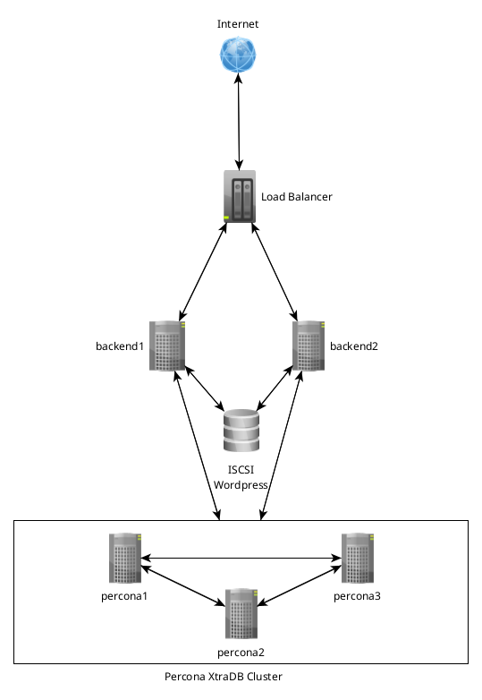
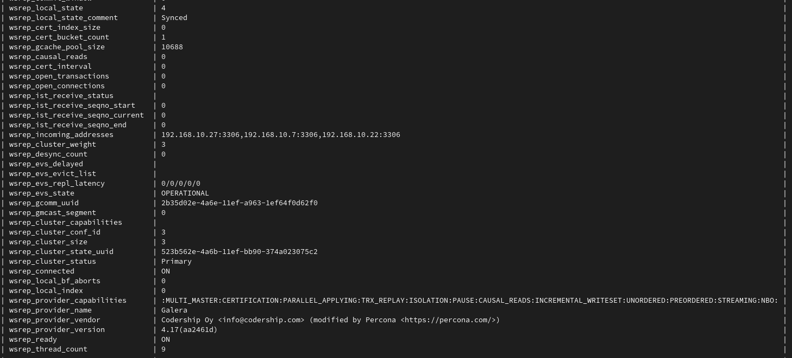
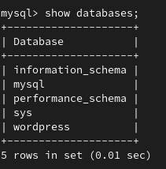

# NGINX - балансировка и отказоусточивость

## Цель

+ Перевести базу веб-проекта на один из вариантов кластера MySQL: Percona XtraDB Cluster или InnoDB Cluster.

## Описание

Основные узлы веб-проекта разворачиваются по аналогии с предыдущими упражнениями. Узел с БД, заменен на 3 ВМ, на которых развернут кластер MySQL. Для демонстрации выбрано решение Percona XtraDB Cluster

Схема следующая:

Вся инфраструктура разворачивается в облаке (Yandex Cloud). Окончательная настройка и установка приложений производится с помощью ansible.

## Результат

В процессе выполнения задания, разворачивается три ВМ (percona1, percona2, percona3). На них устанавливаются необходимые репы, а так же устанавливается пакет percona-xtradb-cluster.

Предварительно создаются ключи, по которым будут синхронизироваться ноды кластера. На каждой ноды необходимы одинаковые ключи, иначе работать не будет.

Все необходимые настройики происходят в /etc/my.cnf. Настройки wsrep находятся в /etc/my.cnf.d/wsrep.cnf.

После настройки бутстрапим первую ноду и запускаем сервис mysql на остальных. Смотрим, что все хорошо. Видно, что нод в кластере 3, wsrep_connected = ON.

Создаем базу и юзеров для работы веб-проекта.

