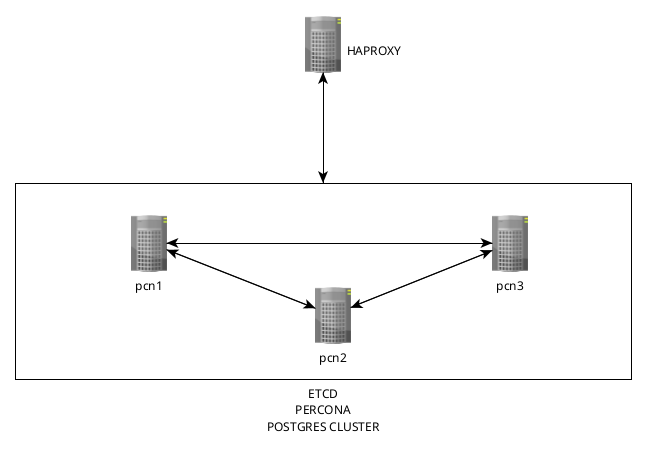
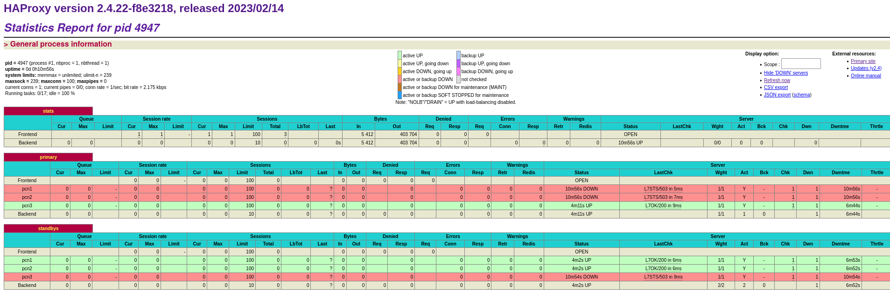
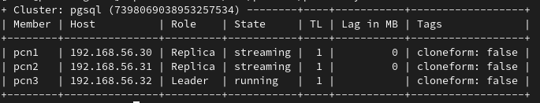
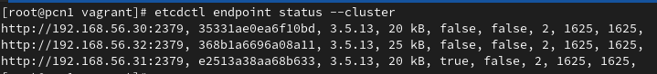
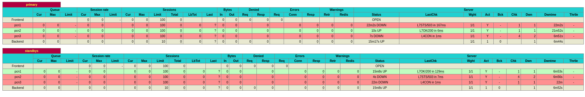
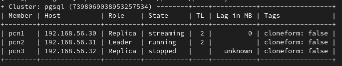

# Реализация кластера postgreSQL с помощью patroni

## Цель

+ Перевести БД веб проекта на кластер postgreSQL с ипользованием patroni, etcd/consul/zookeeper и haproxy/pgbouncer

## Описание

В примере разворачивается 4 ВМ: 3 ВМ - postgresql+etcd+patroni, 1 ВМ - haproxy. ETCD размещен вместе с patroni на одних ВМ. Это делать не рекомендуется, но для экономии и демонстрации работы допустимо. 

Схема следующая:

Вся инфраструктура разворачивается в Vagrant. Окончательная настройка и установка приложений производится с помощью ansible. Так как проект изначально делал на Wordpress, который не очень "дружит" с PostgreSQL, то сделана только работающая часть для демонстрации. По факту через haproxy можно подцепить кластер к любому приложению, которое работает с postgresql.

## Результат

В процессе выполнения задания, разворачивается три ВМ (pcn1, pcn2, pcn3). На них устанавливаются необходимые репы, а так же устанавливается postgresql, patroni и etcd, а также один сервер haproxy для упрощения доступа к кластеру. Он будет контролировать подключение именно к primary ноде.

После проведения настройки видим через "веб-морду" haproxy, работающий primary и standby ноды.

 А также работающий кластер patroni и etcd

Погасим одну ноду для эксперимента. Пусть это будет pcn3, которая primary на данный момент. Видим что была назначена новая нода, в качестве primary, а выключенная перешла в статус failed на haproxy и в отображении утилиты patronictl

