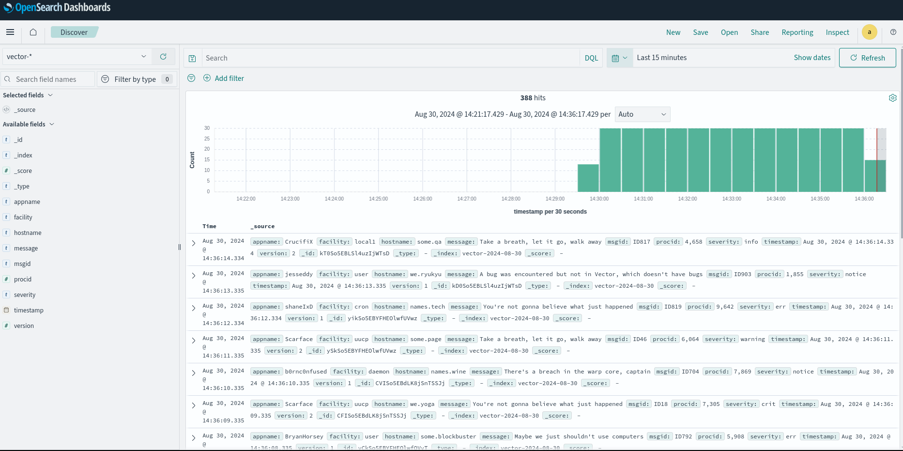

# Elasticsearch (Opensearch)

## Цель

+ Развернуть кластер elasticsearch (минимум 3 ВМ)
+ Настроить сбор логов со всех серверов проекта (веб-сервера, балансеры, базы данных)

## Описание

В этом примере разворачивается стек из opensearch (3 ВМ: 1 master+2 data) + opensearch-dashboards(аналог Kibana) + Vector ( как аналог logstash )

Вся инфраструктура разворачивается в облаке (Yandex Cloud). Окончательная настройка и установка приложений производится с помощью ansible.

Opensearch-dashboards и Vector размещен на одной ВМ, для экономии ресурсов в демонстрационных целях. Так же не организована передача логов со всех сервверов проекта.

## Результат

Работающий сервер opensearch, который получает логи, генерируемый vector. Для настройки получения логов с остальных ВМ, необходимо в разделе source файла vector.yaml добавить источник

