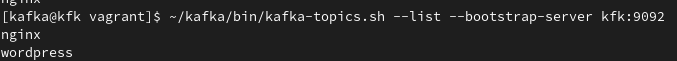
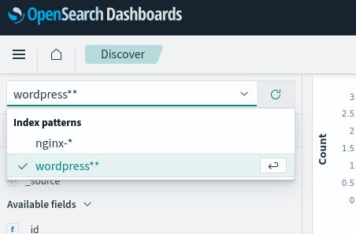
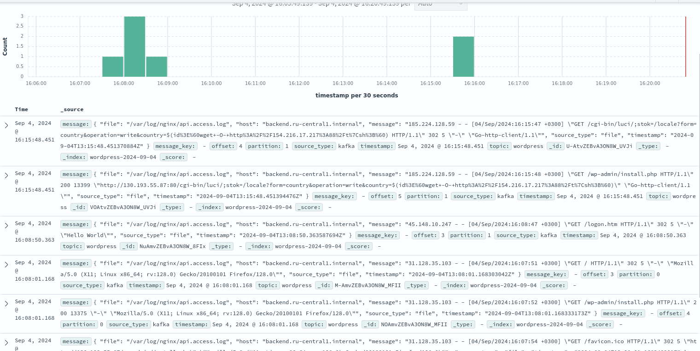

# Реализация очереди для сборщика логов между logstash и elasticsearch

## Цель

+ Настроить сбор логов с веб портала реализованного ранее
+ Настроить kafka как промежуточную очередь между logstash и elasticsearch

## Описание/выполнение

+ Развернута kafka на одной ноде
+ Создано два топика nginx и wordpress

+ На каждой установлен vector
+ С помощью vector собираются логи nginx и wordpress
+ Логи отправляются в два разных топика kafka
+ На одной ноде развернут opensearch ( Elasticsearch в данный момент ограниченно доступен на территории РФ)
+ Настроен vector (logstash в данный момент ограниченно доступен на территории РФ)
+ В opensearch-dashboards (аналог Kibana) настроены индекс паттерны.

Вся инфраструктура разворачивается в облаке (Yandex Cloud). Окончательная настройка и установка приложений производится с помощью ansible.

Wordpress и NGINX размещен на одной ВМ, для экономии ресурсов в демонстрационных целях. Соответственно логи дублирутся.
