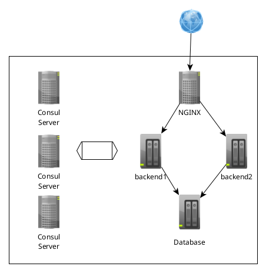
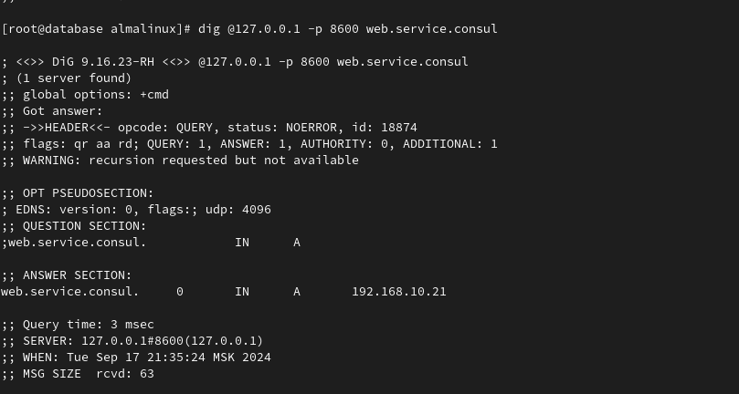

# Consul cluster для service discovery и DNS

## Цель

+ Реализовать consul cluster который выдает доменное имя для web портала с прошлой ДЗ
+ Плавающий IP заменить на балансировку через DNS
+ В случае умирания одного из веб серверов IP должен убираться из DNS.

## Описание/выполнение

Все описание и создание инфраструктуры производится с помощью terraform и Ansible. Схема следующая:

### Реализовать consul cluster который выдает доменное имя для веб портала с прошлой ДЗ

Создается три сервера для Consul cluster

в которых зарегистрирован сервисы Web и Database

Сервисам автоматически назначается DNS адрес. Для регистрации сервиса, установлен consul agent на серверах бэкенда - для web и на сервере БД - для database. Как видим сервису присвоены оба IP бэкендов:

### Плавающий IP заменить на балансировку через DNS

Для реализации балансировки через DNS при помощи consul cluster, на балансировщик NGINX было установлено приложение consul-template. С помощью него автоматически обновляется конфиг NGINX, в части указания на сервера бэкенда.

После отработки роли nginx_consul можем видеть, что конфиг для NGINX обновлен и в нем присутствуют оба сервера, которые необходимо балансировать.

Балансировку именно через DNS настроить н получилось, так как для этого необходимо использовать директиву resolver, которая доступна только в Enterprise версии NGINX.

### В случае умирания одного из веб серверов IP должен убираться из DNS

Гасим NGINX на одном из бэкендов.

Смотрим DNS, один IP адрес "ушел"

Проверяем, как отработал consul-template на балансере

Все отлично конфиг NGINX обновлен.
